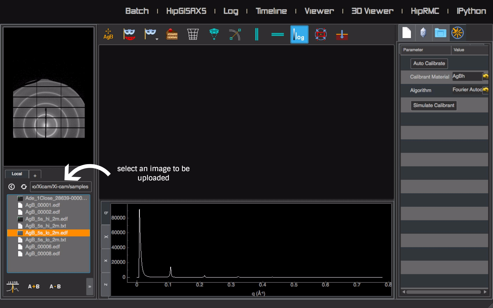
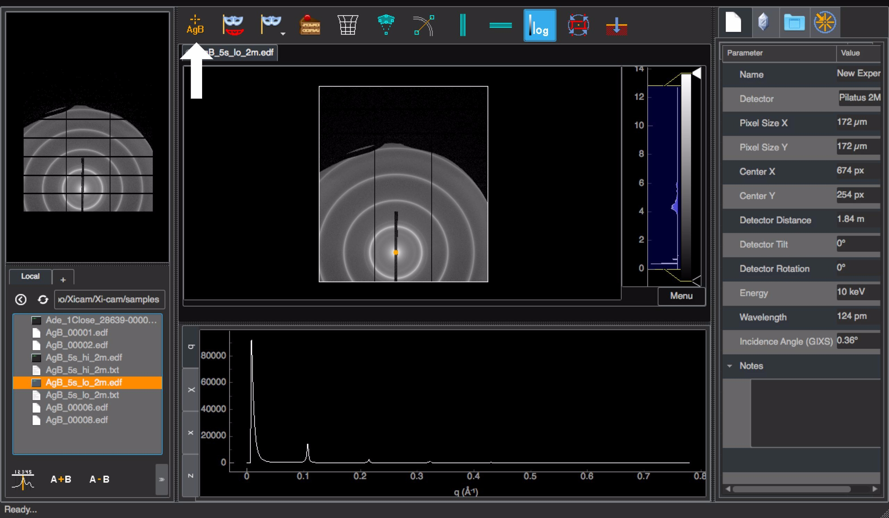
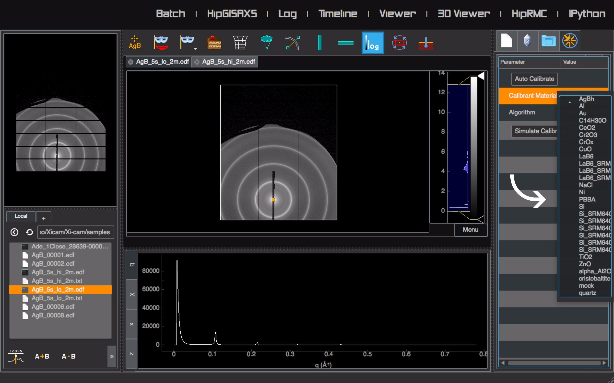
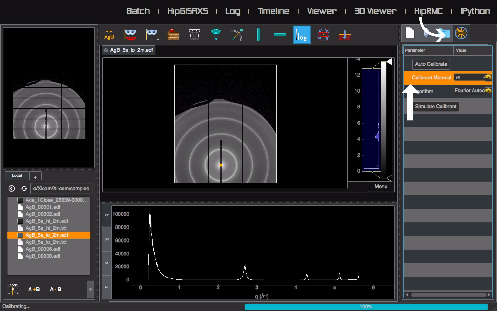
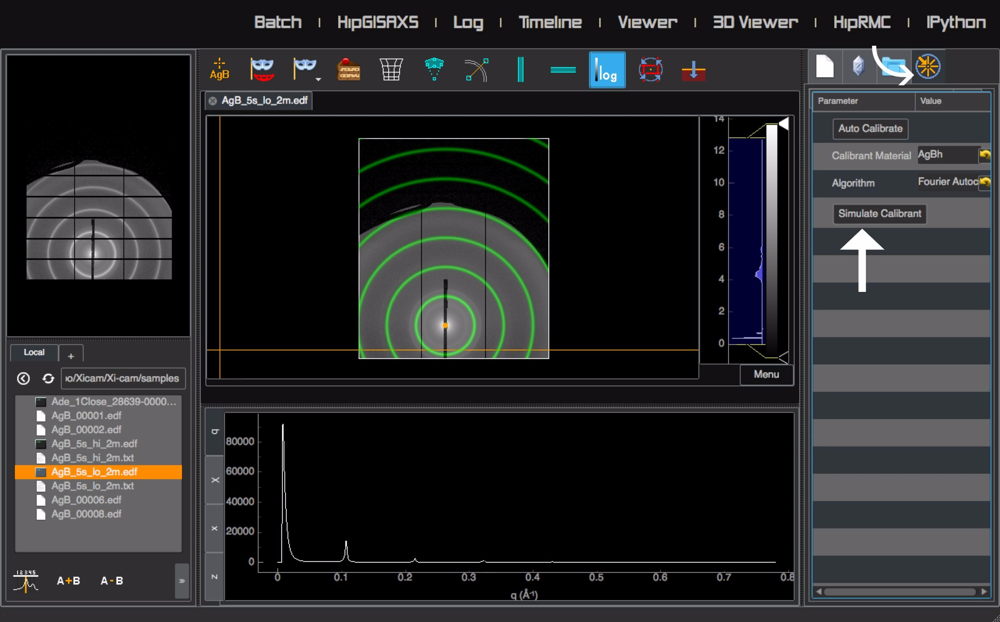

SAXS Tutorial
=============

Small Angle X-ray Scattering is a process used to analyze the ensemble structure, shape, and size of different particles and objects, generally on the order of 1-100 nm.
In SAXS, an X-ray source illuminates a sample and contrasting features of the material cause the light to be scattered.
The scattered light is further analyzed to gain information about the sample itself.

After opening Xi-Cam, click on the Viewer tab to explore SAXS/GISAXS data.

SAXS Calibration
^^^^^^^^^^^^^^^^
The raw image we get from SAXS is acquired in pixel-space form, but it must be converted to q-space to be analyzed.
In order to correctly convert images to q-space, it is necessary to first calibrate. Different calibrants can be used;
a common calibrant is Silver Behenate, AgB.

To open a SAXS image, double-click a file on the lower left part of the screen. You can have multiple scans open at the same
time. To move between images, click on the tabs above the current image.

1-Click AgB Calibration
^^^^^^^^^^^^^^^^^^^^^^^
If calibrating with AgB, you can use the 1-Click AgB calibration feature to auto-calibrate. After selecting the specimen
image, click the AgB button on the top left corner of the screen.

Calibrating with Other Calibrants
^^^^^^^^^^^^^^^^^^^^^^^^^^^^^^^^^
If calibrating with other calibrants, go to the upper right hand side of the screen and click the 4th tab.
Select a calibrant type here, then click the "Calibrate" button.

Manual Calibration
^^^^^^^^^^^^^^^^^^
Instead of auto-calibrating results, it is also possible to manually calibrate your image. To do this, go to the
upper right hand side of the screen and click the 1st tab. You can change any of the parameters, including detector,
pixel size X, pixel size Y, center X, center Y, detector distance, tilt, rotation, energy, wavelength, and the incidence
angle.

Checking Calibration
^^^^^^^^^^^^^^^^^^^^
To check the results of both automatic and manual calibration, go to the upper right hand side of the screen and click
the 4th tab. Click "Simulate Calibrant". When correctly calibrated, the green rings should line up with the rings on the
image. If this is not the case, you can manually adjust the calibration parameters.

