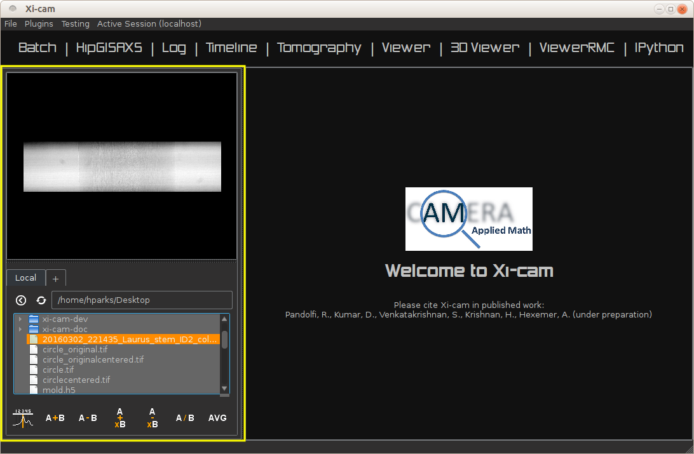
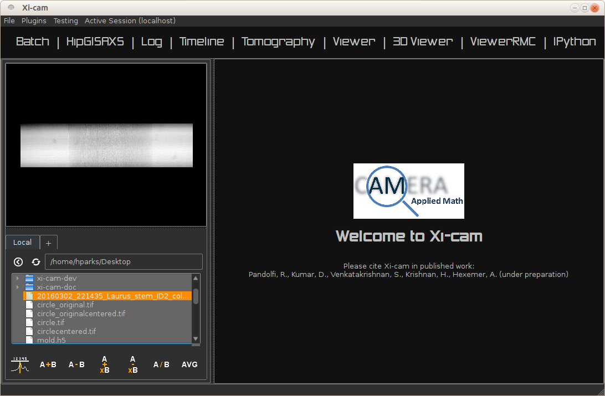
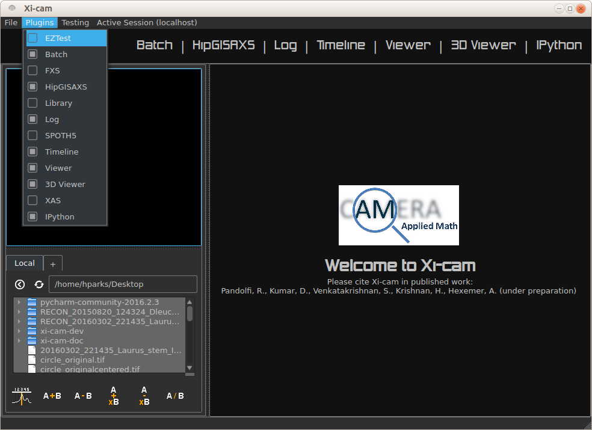
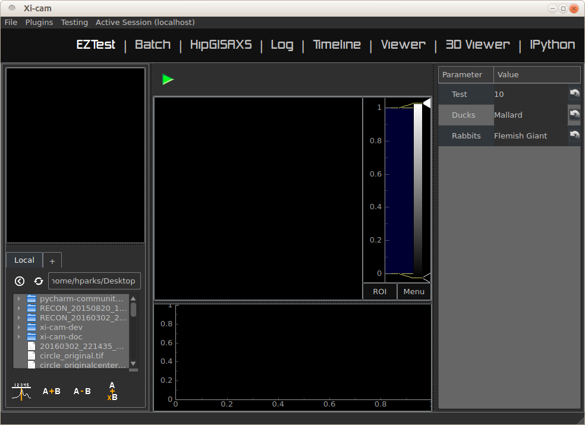
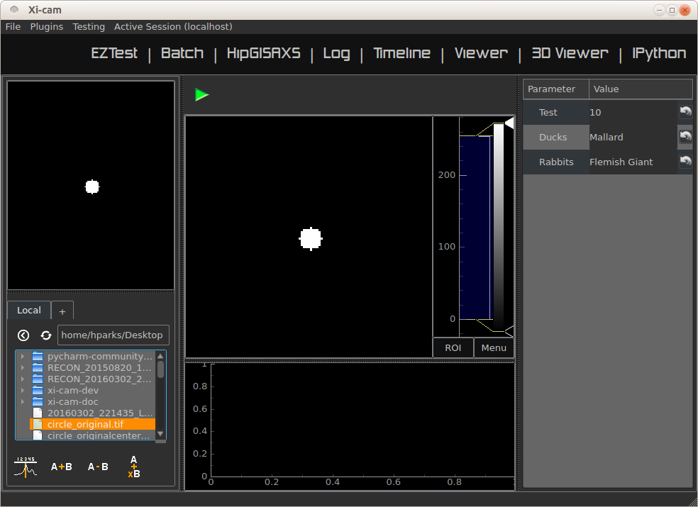
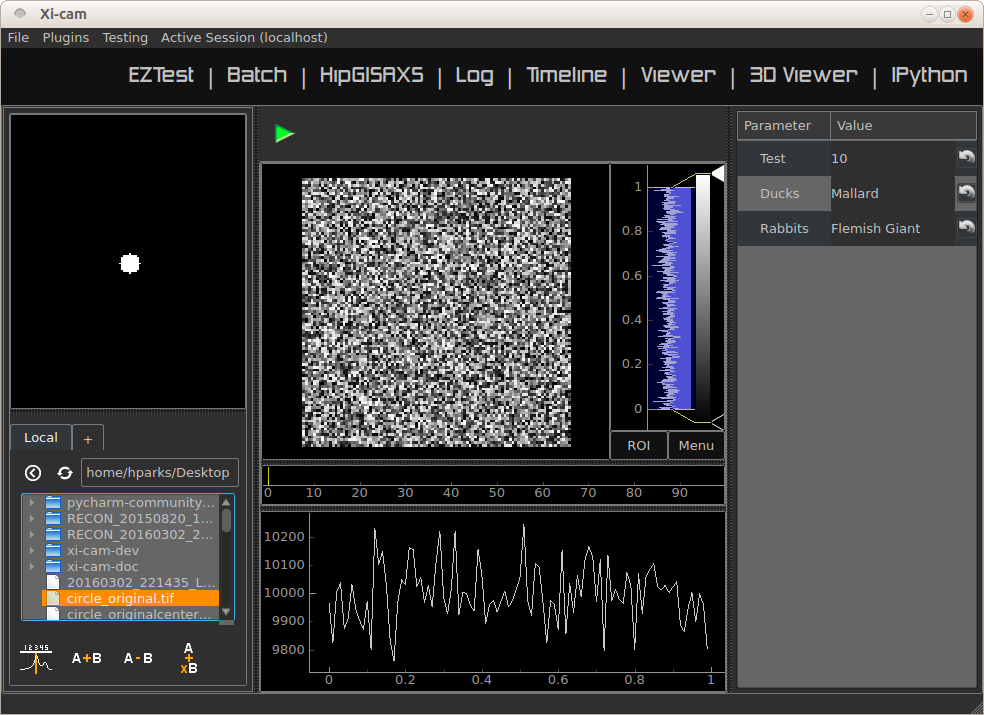

Plugin Development Tutorial
===========================

Plugins allow you to add your own custom analysis and visualization technique to the Xi-cam platform. In the following
sections, we introduce two platforms for plugin development. The EZ plugin requires no knowledge of Qt and is best used
for simpler analyses - see :ref:`EZ`. The advanced plugin requires knowledge of Qt but is more flexible its
applications, so it is best used for more complicated analyses - see :ref:`advanced`. Both platforms require knowledge
of Python.

.. _EZ:

EZ Plugin Development Tutorial
------------------------------

The EZ Plugin is a flexible plugin class for users that do not want to learn Qt. They are easy to write, but limited in
scope compared to plugins which inherit from the base class.

EZ plugins inherit from the ``plugin`` base class from ``xicam.plugins.base.plugin``. For ease of implementation, it
has the following pre-set attributes:

* ``pyqtgraph.ImageView``, for viewing 2D images or plots
* ``pyqtgraph.PlotWidget``, for viewing 1D images or plots
* ``pyqtgraph.ParameterTree``, for holding and editing parameters
* ``toolbar``, to connect buttons to user-written methods.

Plugin Basics
^^^^^^^^^^^^^

First, a few quick notes about your plugins.

* Xi-cam assumes that any module or package in the ``./xicam/plugins/`` folder is a plugin. To ensure that Xi-cam registers your plugin, place your module in this folder
* Each plugin must define a `plugin` class which inherits from ``xicam.plugins.base.plugin``
* Each plugin will use the default widgets of the `plugin` class if not set - see :ref:`advanced`

Plugin Creation
^^^^^^^^^^^^^^^

Our first step is to create the plugin by using the ``EZplugin`` class. Xi-cam assumes that any module/package in the
xicam/plugins directory is a ``plugin``, so place your file in this directory. To create the EZplugin, simply write:

.. code-block:: python

    from xicam.plugins.base import EZplugin

    EZTest = EZplugin()

Now we have a plugin created using the ``EZplugin``'s defaults. Thus it does not have any functionality aside from the
widgets it inherits from the base and ``EZplugin`` classes. To start, we'll provide the plugin with a name:

.. code-block:: python

    from xicam.plugins.base import EZplugin

    EZTest = EZplugin(name = "EZTest")

Tbe Filebrowser and ``openfiles`` Method
^^^^^^^^^^^^^^^^^^^^^^^^^^^^^^^^^^^^^^^^

Each plugin that inherits from the base plugin class (including the ``EZplugin`` class) inherits, by default, a file
browser from the base plugin. Clicking once on any image or dataset brings up a small preview.

Double clicking on the image provides the plugin a path to the selected image. The ``EZplugin`` class comes with
methods that place data into the 1D or 2D data viewers. The user, however, must write the method, the ``openfiles``
method, that takes the path provided by the filebrowser, opens the associated data set, and place the data into the
plugin itself.

.. code-block:: python

    from xicam.plugins.base import EZplugin

    def opentest(filepaths):
        import fabio
        for filepath in filepaths:
            img = fabio.open(filepath).data
            EZTest.setImage(img)

    EZTest = EZplugin(name = "EZTest", openfileshandler = opentest)

Here we have written a function ``opentest`` which takes a path to a set of data (or a list of paths), opens it, and
displays it using the ``setImage`` method. By adding the clause ``openfileshandler = opentest`` to the instantiation,
we set the ``openfiles`` method of the plugin to the ``opentest`` function.

The ``EZplugin`` also has a ``plot`` method, which plots 1D data instead of 2D data: see :ref:`data_ref` for an example
of its use.

The ``openfiles`` method we have written uses the ``open`` function from ``fabio``, a Python paackage. After the data
is opened, the function opens the data using the given path(s) and plots it on the proper viewer.

.. _param_ref:

Parameter Table
^^^^^^^^^^^^^^^

.. _Parameter documentation: http://www.pyqtgraph.org/documentation/parametertree/parameter.html

Parameters are displayed on the right side of the plugin window in a table format. Parameters may be added to this table
in the instantiation. When adding parameters, they must be formatted as dictionaries, and have multiple adjustable
subfields, including the parameter name, type, start value, and default value. Consider the following addition:

.. code-block:: python

    from xicam.plugins.base import EZplugin

    def opentest(filepaths):
        import fabio
        for filepath in filepaths:
            img = fabio.open(filepath).data
            EZTest.setImage(img)

    EZTest = EZplugin(name = "EZTest", parameters = [{'name':'Test','value':10,'type':'int', 'default':10}], \
                    openfileshandler = opentest)

The code above will add a single parameter to the parameters list in the plugin. The parameter is named "Test," is an
integer, and has starting and default values of 10. Adding other parameters follows the same format:

.. code-block:: python

    from xicam.plugins.base import EZplugin

    def opentest(filepaths):
        import fabio
        for filepath in filepaths:
            img = fabio.open(filepath).data
            EZTest.setImage(img)

    params = [{'name':'Test','value':10,'type':'int','default':10},
              {'name': 'Ducks', 'type': 'str', 'value': 'Mallard', 'default': 'Mallard'},
              {'name': 'Rabbits', 'type': 'str', 'value': 'Flemish Giant'}]
    EZTest = EZplugin(name = "EZTest", parameters = params, openfileshandler = opentest)

Adding parameters is also possible with the ``EZplugin`` method ``addParameter``, so long as the parameters follow a
similar format as the previous examples.

Note that the 'value' and 'default' fields are both optional, and do not have to match each other. The parameters are
held in a field of the ``EZplugin`` called ``self.parameters``. You may access these parameters directly. For example,
``self.parameters.child('Rabbits')`` contains all information about the "Rabbits" parameter. So
``self.parameters.child('Rabbits').value()`` and ``self.parameters.child('Rabbits').type()`` return, respectively,
'Flemish Giant' and 'str.'

.. _data_ref:

Data Analysis and the Toolbar
^^^^^^^^^^^^^^^^^^^^^^^^^^^^^

You may perform data analysis by writing plugin methods and connecting these to the ``EZplugin``'s toolbar. The work of
connecting the buttons is performed by the ``EZplugin``'s instantiation method. To add a button, you must provide a
function to connect to the button, an icon for the button, and (optional) a name to associate with the button. Here is a
simple example:

.. code-block:: python

    from xicam.plugins.base import EZplugin

    def opentest(filepaths):
        ...

    def runtest():
        import numpy as np

        img = np.random.random((100,100,100))
        EZTest.setImage(img)

        hist = np.histogram(img,100)
        EZTest.plot(hist[1][:-1],hist[0])

    params = [{'name':'Test','value':10,'type':'int','default':10},
              {'name': 'Ducks', 'type': 'str', 'value': 'Mallard', 'default': 'Mallard'},
              {'name': 'Rabbits', 'type': 'str', 'value': 'Flemish Giant'}]

    EZTest = EZplugin(name = "EZTest", toolbuttons=[('xicam/gui/icons_34.png',runtest, 'Run test')], parameters = params, openfileshandler = opentest)

The two important additions are the function ``runtest``, which creates an image and 1D histogram and plots them both
in the appropriate viewers. The addition ``toolbuttons=[('xicam/gui/icons_34.png',runtest, 'Run test')]`` to the
instantiation connects this function to a button represented by ``icons_34.png``. Clicking the button will cause
``runtest`` to run. The string ``'Run test'`` is the name associated with the button. To add more buttons, you
must provide similar tuples with 1) an icon path, 2) a method, and 3) a name.

Adding buttons is also possible with the ``addToolButton`` method of ``EZplugin``.

It is possible to use the parameters in ``self.parameters`` for your functions by accessing them directly: see the
last paragraph of :ref:`param_ref`.

Example
^^^^^^^

In this example we will show the functionality of the plugin we have built in the previous sections. The code in its
entirety is shown below:

.. code-block:: python

    from xicam.plugins.base import EZplugin

    def opentest(filepaths):
        import fabio
        for filepath in filepaths:
            img = fabio.open(filepath).data
            EZTest.setImage(img)

    def runtest():
        import numpy as np

        img = np.random.random((100,100,100))
        EZTest.setImage(img)

        hist = np.histogram(img,100)
        EZTest.plot(hist[1][:-1],hist[0])

    params = [{'name':'Test','value':10,'type':'int','default':10},
              {'name': 'Ducks', 'type': 'str', 'value': 'Mallard', 'default': 'Mallard'},
              {'name': 'Rabbits', 'type': 'str', 'value': 'Flemish Giant'}]

    EZTest = EZplugin(name = "EZTest", toolbuttons=[('xicam/gui/icons_34.png',runtest, 'Run test')], parameters = params, openfileshandler = opentest)

The opening screen of Xi-cam is shown in the image below.

The list of available plugins is shown at the bar at the top ("Batch", "HipGISAXS", "Log", etc). To add the "EZTest"
exaample, click the "plugins" bar at the top of the page and click the "EZTest" option.

Clicking on the "EZTest" tab will lead you to the interface. The parameters tab is on the right, and empty viewers in
the center.

Double clicking an image in the filebrowser brings it up on the viewer, due to the ``opentest`` function we wrote.

Finally, clicking the green arrow above the 2D viewer will cause the ``runtest`` function to run. The output is shown
in the image below.

.. _advanced:

Advanced Plugin Development Tutorial
------------------------------------

.. highlight:: python
    :linenothreshold: 2

Plugins allow you to add your own custom analysis and visualization technique in the Xi-cam platform. This requires some
knowledge of Python and Qt. In this tutorial we demonstrate implementing a plugin for an external binary, HipRMC.

The HipRMC binary accepts a single argument: an input parameter file. HipRMC outputs by writing images to disk.
This plugin mediates these exchanges and displays the results.

Recall that **Xi-cam assumes that any module/package in the xicam/plugins directory is a `plugin`.** All Xi-cam plugins must define a
`plugin` class which inherits `xicam.plugins.base.plugin` and has attributes defining the locations of its widgets.
The following attributes are optionally inserted into the Xi-cam interface layout:

*   `plugin.centerwidget`
*   `plugin.leftwidget`
*   `plugin.rightwidget`
*   `plugin.bottomwidget`
*   `plugin.toolbar`

When not set, default widgets are used. When set to `None`, the corresponding layout element is not shown.

We first start with a short tutorial in which we some basic plugin functionality, before moving on to the full
HipRMC example.

Plugin creation
^^^^^^^^^^^^^^^

Our first step is to create the plugin subclass which defines necessary plugin attributes. Again, this file must be
created in the directory xicam/plugins to be detected as a plugin:

.. code-block:: python

    from xicam.plugins import base

    class plugin(base.plugin):
        name = "ViewerRMC"

        def __init__(self, *args, **kwargs):

            super(plugin, self).__init__(*args, **kwargs)
            self.centerwidget = None
            self.rightwidget = None
            self.leftwidget = None
            self.bottomwidget = None
            self.toolbbar = None

The first line imports the plugin base class. The rest of the code names the plugin subclass ("ViewerRMC") and
instantiates it when Xi-Cam is run. It also sets each widget inherited from the base ``plugin`` class to `None`,
which hides each of these widgets. The plugin at this point literally shows nothing.

Of course, we don't want to keep it this way. We would like to display images in this plugin, so we add a ``QTabWidget``, from ``Pyside.QtGui``, to hold these
images and set it to the plugin's `centerwidget`.

.. code-block:: python

    from xicam.plugins import base
    from PySide import QtGui

    class plugin(base.plugin):
        name = "ViewerRMC"

        def __init__(self, *args, **kwargs):

            self.centerwidget = QtGui.QTabWidget()
            self.centerwidget.setDocumentMode(True)
            self.centerwidget.setTabsClosable(True)
            self.rightwidget = None

            super(plugin, self).__init__(*args, **kwargs)

The first line added overrides the base plugin's ``centerwidget`` by adding a ``QTabWidget``. The second line formats
the widget so that most of its frame is not shown. The final line sets the ``rightwidget`` to ``None``. As a result,
this plugin will not show a ``rightwidget``. The third allows tabs to be closed by the user. We must add this
functionality manually with a method that takes and deletes tabs.

.. code-block:: python

    from xicam.plugins import base

    class plugin(base.plugin):
        name = "ViewerRMC"

        def __init__(self, *args, **kwargs):

            self.centerwidget = QtGui.QTabWidget()
            self.centerwidget.setDocumentMode(True)
            self.centerwidget.setTabsClosable(True)
            self.centerwidget.tabCloseRequested.connect(self.tabClose)
            self.rightwidget = None

            super(plugin, self).__init__(*args, **kwargs)

        def tabClose(self,index):
            self.centerwidget.widget(index).deleteLater()

In the ``__init__`` method, we added a line that connects a tab close request to the method ``tabClose`` when the
user requests a tab. ``tabClose`` takes and deletes the tab as requested by the user.

Opening and Displaying Images
^^^^^^^^^^^^^^^^^^^^^^^^^^^^^

To display an image, we'll write a method that takes a path and opens the image. The base ``plugin`` class has an
empty ``openfiles`` method that will be overriden by your plugin's own ``openfiles`` method.

.. code-block:: python

    from xicam.plugins import base
    from PySide import QtGui
    from pipeline import loader
    import pyqtgraph as pg

    class plugin(base.plugin):

    ...

        def openfiles(self, paths):
            self.activate()
            if type(paths) == list:
                self.path = paths[0]
            else:
                self.path = paths

            self.orig_image = np.transpose(loader.loadimage(self.path))

            self.orig_view = pg.ImageView()
            self.orig_view.setContentsMargins(0,0,0,0)
            self.orig_view.setImage(self.orig_image)
            self.centerwidget.addTab(self.orig_view, 'image')

Displaying an image requires ``pyqtgraph`` and the ``loader`` function from ``pipeline``, a Xi-Cam module. First we
activate the plugin using the ``activate`` method inherited from the base class. The image is loaded using the
``loader`` function, but displaying it requires an ``ImageView`` object from ``pyqtgraph``. The image is loaded into an
``ImageView`` object, which itself is then loaded into the ``centerwidget`` of the plugin.

Adding and Displaying Parameters
^^^^^^^^^^^^^^^^^^^^^^^^^^^^^^^^

In this example we use a ``ParameterTree`` from ``pyqtgraph`` to display parameters of interest:

.. code-block:: python

    from xicam.plugins import base
    from PySide import QtGui
    from pipeline import loader
    import pyqtgraph as pg
    from pyqtgraph import parametertree as pt

    ...
    class plugin(base.plugin):
        name = "ViewerRMC"

        def __init__(self):

        ...

             self.scatteringParams = pt.ParameterTree()
             params = [{'name': 'Num tiles', 'type': 'int', 'value': 1, 'default': 1},
                       {'name': 'Loading factor', 'type': 'float', 'value': 0.5, 'default': 0.5},
                       {'name': 'Scale factor', 'type': 'int', 'value': 32, 'default': 32},
                       {'name': 'Numsteps factor', 'type': 'int', 'value': 100, 'default': 100},
                       {'name': 'Model start size', 'type': 'int', 'value': start_size},
                       {'name': 'Save Name', 'type': 'str', 'value': 'processed'}]
             self.configparams = pt.Parameter.create(name='Configuration', type='group', children=params)
             self.scatteringParams.setParameters(self.configparams, showTop=False)
             self.centerwidget.addTab(self.scatteringParams)

The parameters shown here are specific to running HipRMC, but this format can be used equally well on any set of
parameters. This code sets the parameters as a list and loads them into a ``ParameterTree``. To add another parameter
called, say, "time," we must add the parameter name, type, and starting and default values (both optional) to the
``params`` list:

.. code-block:: python

             self.scatteringParams = pt.ParameterTree()
             params = [{'name': 'Num tiles', 'type': 'int', 'value': 1, 'default': 1},
                       {'name': 'Loading factor', 'type': 'float', 'value': 0.5, 'default': 0.5},
                       {'name': 'Scale factor', 'type': 'int', 'value': 32, 'default': 32},
                       {'name': 'Numsteps factor', 'type': 'int', 'value': 100, 'default': 100},
                       {'name': 'Model start size', 'type': 'int', 'value': start_size},
                       {'name': 'Save Name', 'type': 'str', 'value': 'processed'}.
                       {'name': 'time', 'type': 'int', 'value': 1, 'default': 1}]
             self.configparams = pt.Parameter.create(name='Configuration', type='group', children=params)
             self.scatteringParams.setParameters(self.configparams, showTop=False)
             self.centerwidget.addTab(self.scatteringParams)

This new line adds a "time" parameter of default value 1 to the parameters list. To access the values, we use a
``pyqtgraph`` method ``child()``. For example, ``self.configparams.child('time').value()`` returns ``1``.

Creating and Wiring a Button
^^^^^^^^^^^^^^^^^^^^^^^^^^^^

Creating and wiring a button to a method is very straightforward:

.. code-block:: python

    from xicam.plugins import base
    ...
    class plugin(base.plugin):
        name = "ViewerRMC"

        def __init__(self):
        ...

            funcButton = QtGui.QPushButton("Run function")
            self.centerwidget.addTab(funcButton)
            funcButton.clicked.connect(self.function)

The first two lines create the button and add it to the plugin. The third connects it to a method called ``function``,
which must be written by the user:

.. code-block:: python

    from xicam.plugins import base
    ...
    class plugin(base.plugin):
        name = "ViewerRMC"

        def __init__(self):
        ...

            funcButton = QtGui.QPushButton("Run function")
            self.centerwidget.addTab(funcButton)
            funcButton.clicked.connect(self.function)

        def function(self):
            print "hello"

Now once the button is pressed by the user, the terminal will print "hello."

ViewerRMC Full Example
^^^^^^^^^^^^^^^^^^^^^^

For the viewer which will display HipRMC output, we need more functionality. Specifically, HipRMC only works on square
images, and accepts as an input a parameter file. We would like to see its output on the GUI as well. This full example
uses code written above, but much of it is rearranged.

.. code-block:: python

    import os
    from PySide import QtGui
    from xicam.plugins import base
    from xicam import config
    import pyqtgraph as pg
    from pyqtgraph import parametertree as pt
    from fabio import tifimage
    from pipeline import loader, hig, msg
    import numpy as np
    import subprocess
    import xicam.RmcView as rmc

    class plugin(base.plugin):
        name = "ViewerRMC"

        def __init__(self, *args, **kwargs):

            self.centerwidget = QtGui.QTabWidget()
            self.centerwidget.setDocumentMode(True)
            self.centerwidget.setTabsClosable(True)
            self.centerwidget.tabCloseRequested.connect(self.tabCloseRequested)
            self.rightwidget = None

            super(plugin, self).__init__(*args, **kwargs)

        def openfiles(self, paths):
            self.activate()
            view_widget = inOutViewer(paths = paths)
            self.centerwidget.addTab(view_widget, os.path.basename(paths[0]))
            self.centerwidget.setCurrentWidget(view_widget)
            view_widget.drawCameraLocation(view_widget.orig_view,view_widget.cameraLocation)

        def tabCloseRequested(self,index):
            self.centerwidget.widget(index).deleteLater()

Must of the plugin methods remain the same, with the exception of the ``openfiles`` method. Here we create an object
called an ``inOutViewer`` which will hold the image, the image after the camera location has been centered, and the
output of HipRMC. The ``inOutViewer`` class is defined below. The ``drawCameraLocation`` is a method of ``inOutViewer``.
It draws the camera location of the image as a dot.

.. code-block:: python

    class inOutViewer(QtGui.QWidget, ):
        def __init__(self, paths, parent=None):

            super(inOutViewer, self).__init__(parent=parent)

            layout = QtGui.QHBoxLayout()
            self.cameraLocation = config.activeExperiment.center
            self.rmc_view= None    #this will hold the output of hiprmc
            self.edited_image = None    #this will hold the centered image

The ``inOutViewer`` class inherits from the QWidget class in PySide. ``layout`` is the layout of the widget (which we
choose to be horizontal), and the camera location, ``self.cameraLocation``, is accessed through the ``config``
Xi-Cam module. Note that the camera location must be set manually using Xi-Cam's ``Viewer'' plugin.

.. code-block:: python

            # load and display image
            self.orig_view = pg.ImageView(self)
            self.orig_view.setContentsMargins(0,0,0,0)
            if type(paths) == list:
                self.path = paths[0]
            else:
                self.path = paths

            self.orig_image = np.transpose(loader.loadimage(self.path))

            self.image_holder = QtGui.QStackedWidget()
            self.image_holder.setContentsMargins(0,0,0,0)
            self.orig_view.setImage(self.orig_image)
            self.orig_view.autoRange()

            self.image_holder.addWidget(self.orig_view)

This block . The ``ImageView`` object itself is loaded into ``image_holder``, a ``QStackedWidget`` that allows
windows to be stacked on top of each other. The ``image_holder`` will hold the original and edited images, as well as
the HipRMC output, in different tabs.

.. code-block:: python

            # configuring the right widget
            sideWidgetFormat = QtGui.QVBoxLayout()
            sideWidgetFormat.setContentsMargins(0, 0, 0, 0)

             try:
                start_size = max(self.orig_image.shape)
             except ValueError:
                print "Image must be 2-D"

             self.scatteringParams = pt.ParameterTree()
             params = [{'name': 'Num tiles', 'type': 'int', 'value': 1, 'default': 1},
                       {'name': 'Loading factor', 'type': 'float', 'value': 0.5, 'default': 0.5},
                       {'name': 'Scale factor', 'type': 'int', 'value': 32, 'default': 32},
                       {'name': 'Numsteps factor', 'type': 'int', 'value': 100, 'default': 100},
                       {'name': 'Model start size', 'type': 'int', 'value': start_size},
                       {'name': 'Save Name', 'type': 'str', 'value': 'processed'}]
             self.configparams = pt.Parameter.create(name='Configuration', type='group', children=params)
             self.scatteringParams.setParameters(self.configparams, showTop=False)

             scatteringHolder = QtGui.QStackedWidget()
             scatteringHolder.addWidget(self.scatteringParams)
             scatteringHolder.setFixedHeight(300)
             scatteringHolder.setSizePolicy(QtGui.QSizePolicy.Fixed,QtGui.QSizePolicy.Fixed)

             centerButton = QtGui.QPushButton("Center camera location")
             runButton = QtGui.QPushButton("Run RMC processing")
             sideWidgetFormat.addWidget(scatteringHolder)
             sideWidgetFormat.addSpacing(5)
             sideWidgetFormat.addWidget(centerButton)
             sideWidgetFormat.addSpacing(5)
             sideWidgetFormat.addWidget(runButton)

             centerButton.clicked.connect(self.center)
             runButton.clicked.connect(self.runRMC)

             self.headings = QtGui.QTabBar(self)
             self.headings.addTab('Original Image')
             self.headings.addTab('Recentered Image')
             self.headings.addTab('RMC Timeline')
             self.headings.setShape(QtGui.QTabBar.TriangularSouth)

The ``__init__`` method sets and fills the layout of most of the plugin. In the code block above, we create the right
side of the center widget, which holds the parameters for running HipRMC, as well as buttons for processing our
original image. The parameters are set set and held in a ``ParameterTree``. The bottom two blocks show, respectively,
the connection of buttons to processing methods belonging to the ``inOutViewer`` class, and the creation of a
``QTabBar`` that allows users to toggle between the original image, the centered image, and the HipRMC output.

.. code-block:: python

            self.drawROI(0,0,self.orig_image.shape[0],self.orig_image.shape[1],
                         self.orig_view.getImageItem().getViewBox())

            self.edited_view = pg.ImageView(self)
            self.image_holder.addWidget(self.edited_view)

            sidelayout = QtGui.QVBoxLayout()
            sidelayout.addWidget(self.image_holder)
            sidelayout.addWidget(self.headings)

            layout.addLayout(sidelayout,10)
            layout.addLayout(sideWidgetFormat,4)
            self.setLayout(layout)

            self.headings.currentChanged.connect(self.currentChanged)
            self.image_holder.currentChanged.connect(self.headings.setCurrentIndex)

This final few blocks does a few things. It draws an ROI (region of interest) around the image using a method defined
below in case it is hard to see on the background of the viewer. It also creates a place to place the centered image,
which does not exist until the ``centerButton`` is pressed by the user. It then lays out the entire center widget.
The final two lines allow the user to change tabs in the ``image_holder``, and call on a short method reproduced
below:

.. code-block:: python

    def currentChanged(self,index):
        self.image_holder.setCurrentIndex(index)

The other methods are as follows:

.. code-block:: python

        def center(self):

            # if there is already an edited image, discard to make space for a new one
            if self.edited_image is not None:
                self.image_holder.removeWidget(self.edited_view)
                self.edited_view = pg.ImageView(self)
                self.image_holder.addWidget(self.edited_view)

            #resize image so that it's in center
            #displays output on stackwidget

            xdim= self.orig_image.shape[0]
            ydim = self.orig_image.shape[1]

            newx = xdim + 2*abs(self.cameraLocation[0]-xdim/2)
            newy = ydim + 2*abs(self.cameraLocation[1]-ydim/2)
            self.new_dim = max(newx,newy)

            self.edited_image = np.ones((self.new_dim,self.new_dim),dtype = np.int)
            new_center = (self.new_dim/2,self.new_dim/2)

            lowleft_corner_x = new_center[0]-self.cameraLocation[0]
            lowleft_corner_y = new_center[1]-self.cameraLocation[1]

            self.edited_image[lowleft_corner_x:lowleft_corner_x+xdim,lowleft_corner_y: lowleft_corner_y+ydim] \
                = self.orig_image

            # save image
            self.write_path = self.path
            if self.write_path.endswith('.tif'):
                self.write_path = self.write_path[:-4]+'centered.tif'
            else:
                self.write_path += '_centered.tif'
            img = tifimage.tifimage(np.rot90((self.edited_image.astype(float)/
                                              self.edited_image.max()*2**16).astype(np.int16)))
            img.write(self.write_path)

            self.edited_view.setImage(self.edited_image)

            box = self.drawCameraLocation(self.edited_view,new_center)
            self.drawROI(lowleft_corner_x,lowleft_corner_y,xdim,ydim, box)
            self.drawROI(0,0,self.new_dim,self.new_dim,box)

            self.image_holder.setCurrentIndex(1)

        def drawCameraLocation(self,imageView_item,location):

            cameraBox = imageView_item.getImageItem().getViewBox()
            cameraPlot = pg.ScatterPlotItem()
            cameraBox.addItem(cameraPlot)
            cameraPlot.setData([location[0]], [location[1]], pen=None,
                                    symbol='o' , brush=pg.mkBrush('#FFA500'))

            return cameraBox

        def drawROI(self, xpos, ypos, xdim,ydim, view_box):

            roi = pg.RectROI((xpos,ypos),(xdim,ydim),movable = False,removable=True)
            view_box.addItem(roi)

These three methods relate to centering the input image. The first is connected to the ``centerButton`` wired in the
creation of the ``inOutViewer`` class. It creates a new image so that the camera location of the input image is in the
center of the new image. It also writes the new image in the working directory. The second method draws the camera
location as a dot in the center of the new image. The third method draws an ROI in a specified location. The first
method calls the second once to draw the camera location, and the third method twice to draw ROIs around the old and new
images.

.. code-block:: python

        def runRMC(self):
            msg.showMessage('Running RMC for centered version of {}'.format(self.path), timeout=0)

            # if there is already a viewer present, remove it to make room for another
            if self.rmc_view is not None:
                self.image_holder.removeWidget(self.rmc_view)

            if self.edited_image is None:
                msg.showMessage('Error: no image loaded',timeout = 0)
                msg.clearMessage()
                return

            params = self.configparams
            hig_info = {'hipRMCInput': {'instrumentation': {'inputimage': "{}".format(self.write_path),
                                                 'imagesize': [self.new_dim, self.new_dim ],
                                                 'numtiles': params.child('Num tiles').value(),
                                                 'loadingfactors': [params.child('Loading factor').value()]},
                             'computation': {'runname': "{}".format(params.child('Save Name').value()),
                                             'modelstartsize': [params.child('Model start size').value(),
                                                                params.child('Model start size').value()],
                                             'numstepsfactor': params.child('Numsteps factor').value(),
                                             'scalefactor': params.child('Scale factor').value()}}}

            h = hig.hig(**hig_info)
            hig_name = './' + params.child('Save Name').value()
            if not hig_name.endswith('.hig'):
                hig_name += '.hig'

            h.write(hig_name)
            proc = subprocess.Popen(['./hiprmc/bin/hiprmc', hig_name], stdout=subprocess.PIPE, stderr=subprocess.PIPE)
            output, err = proc.communicate()

            msg.showMessage('Done')

            # complicated way of finding and writing into folder name written by hiprmc
            ind = output.index(params.child('Save Name').value())
            rmc_folder = './{}'.format(output[ind:].split("\n")[0])
            os.rename(hig_name, '{}/{}.hig'.format(rmc_folder,params.child('Save Name').value()))

            # write output of RMC to file in hiprmc output folder
            output_path = rmc_folder + "/{}_rmc_output.txt".format(params.child('Save Name').value())
            with open(output_path, 'w') as txt:
                txt.write(output)

            # add rmcView to tabwidget
            self.rmc_view = rmc.rmcView(rmc_folder)
            self.rmc_view.findChild(QtGui.QTabBar).hide()
            self.rmc_view.setContentsMargins(0,0,0,0)
            self.image_holder.addWidget(self.rmc_view)

            self.image_holder.setCurrentIndex(2)

This final method is connected to the ``runButton`` in the ``inOutViewer``. It takes the params held in the
``inOutViewer`` and writes them into a ``hig`` file, the necessary input for the ``hiprmc`` code. The method calls
``hiprmc`` as a subprocess. ``hiprmc`` writes a folder of images, so the method writes its feedback as a ``txt``, and
transfer this and the ``hig`` file to this folder. Finally, it creates an ``rmcView`` class, a Xi-Cam module, to
display the output images.
