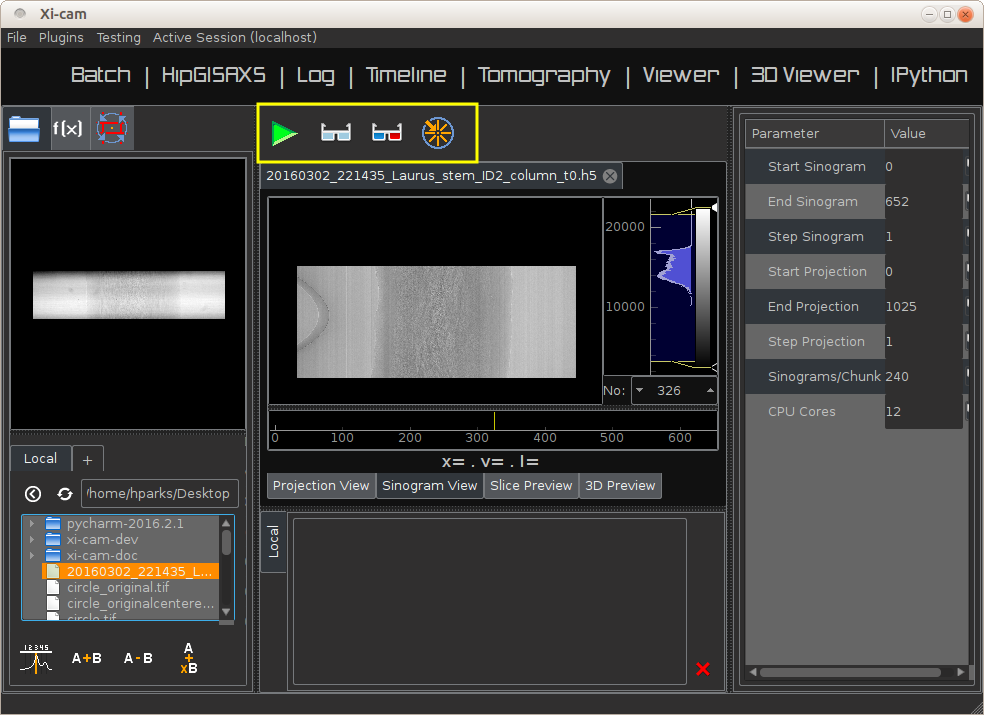
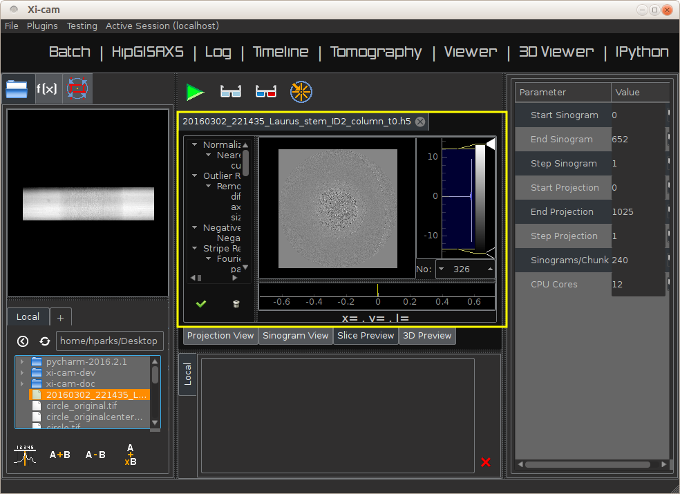
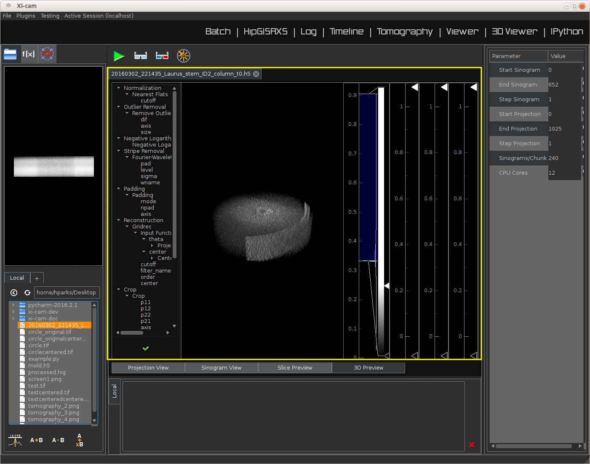
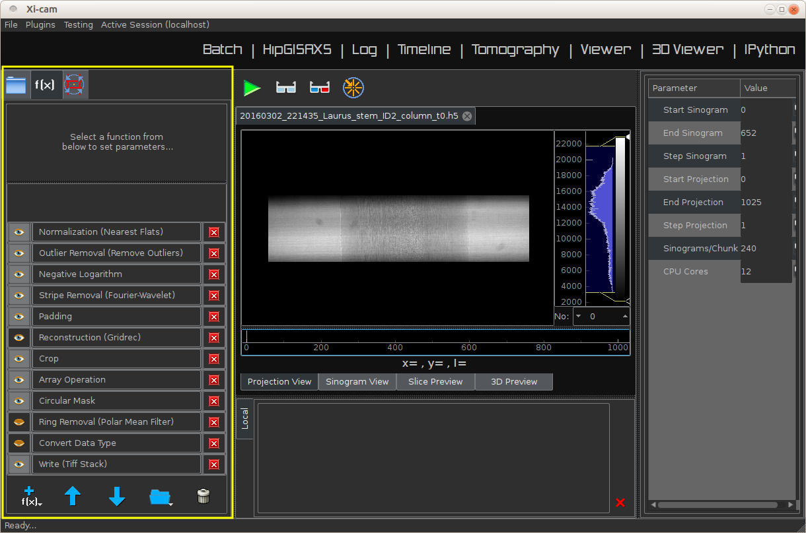
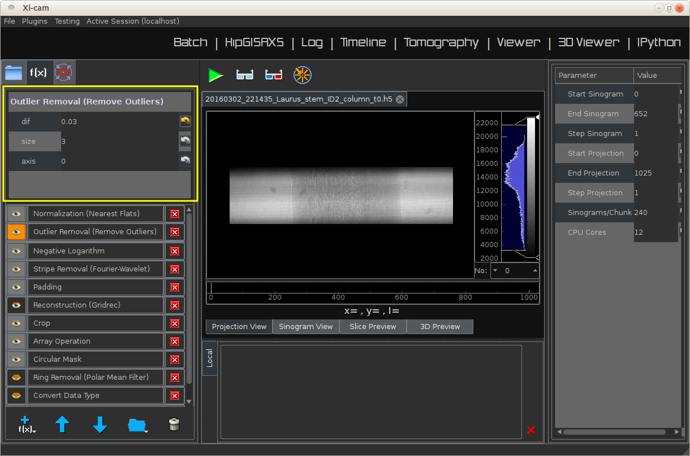
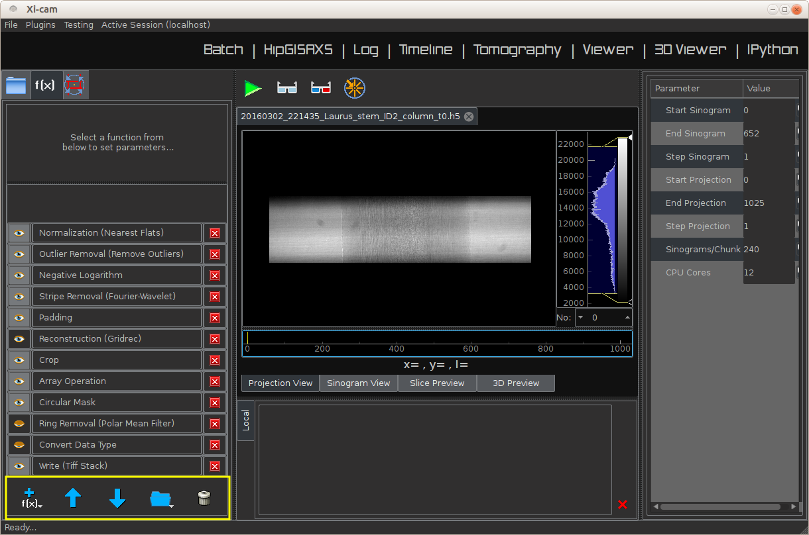
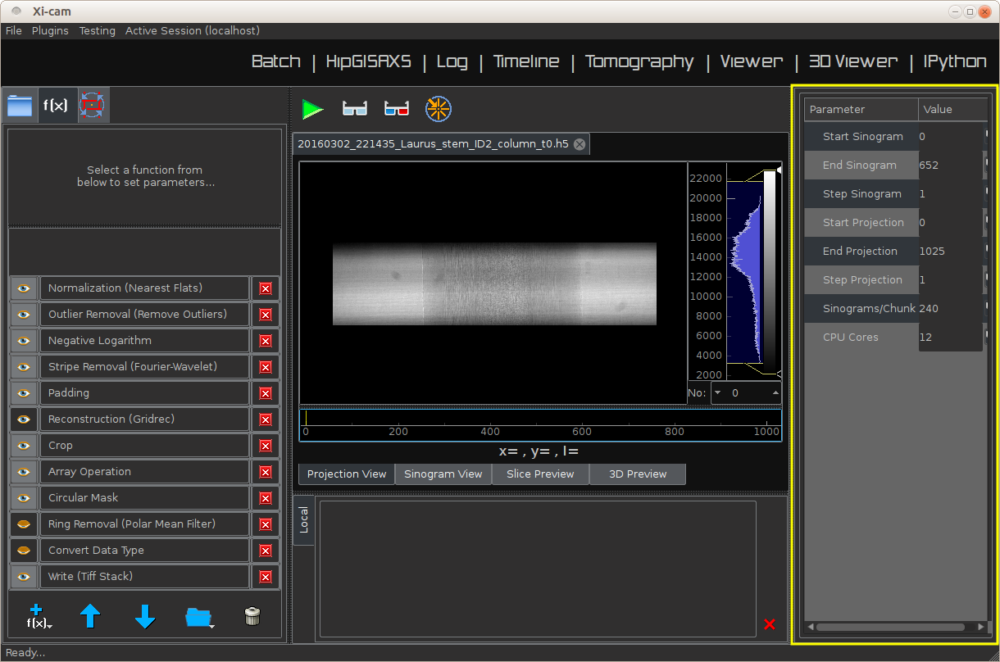
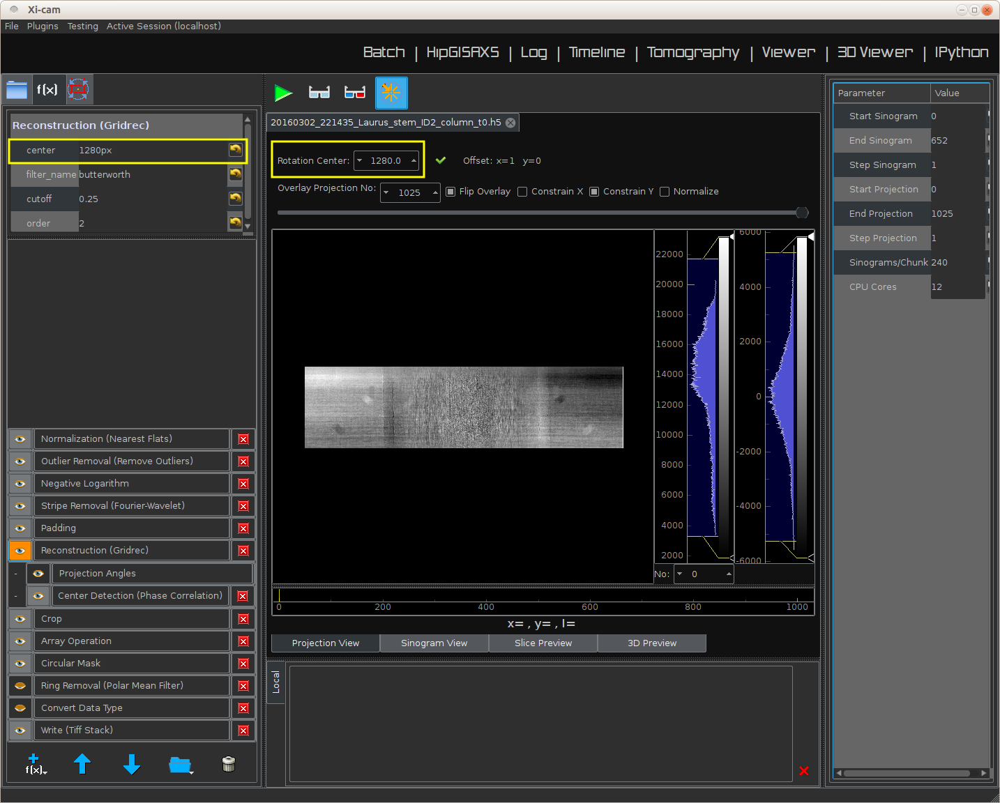
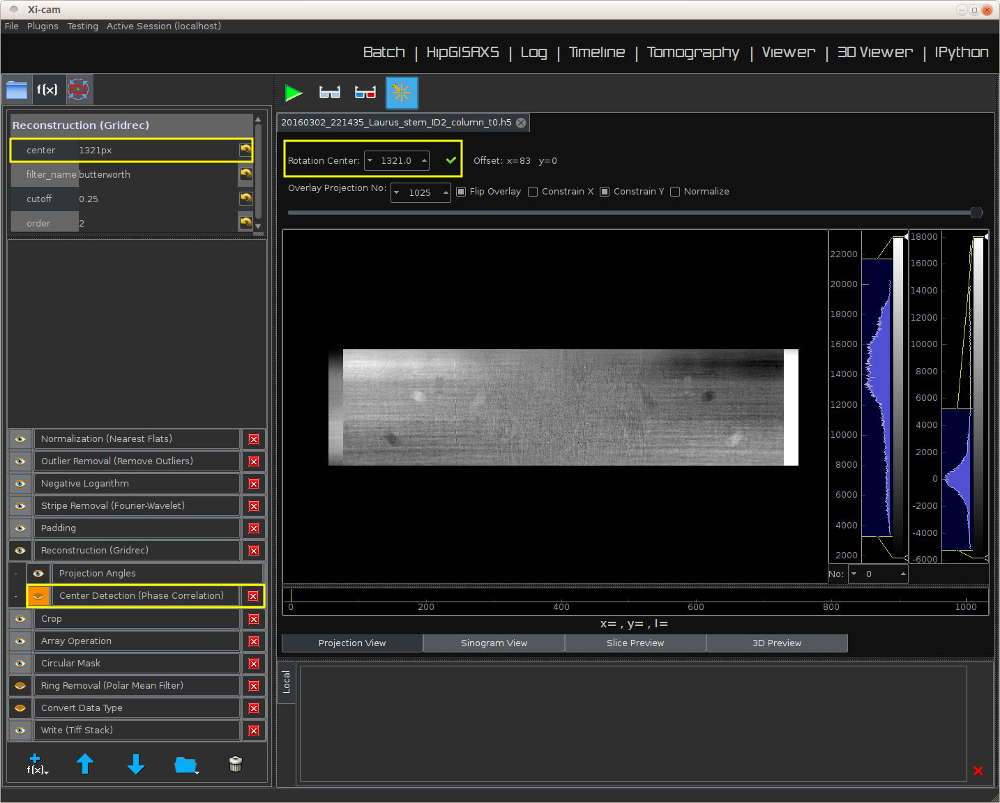

Plugin User Tutorials
=====================

Xi-Cam supports a number of different plugins to analyze a variety of synchrotron data. This section provides short
tutorials for using some of these plugins.

Tomography
----------

The tomography plugin is a graphical environment for viewing, analyzing, and reconstructing tomographic data. It uses
the ``TomoPy`` Python library for its processing. With the tomography plugin, you may:

* View the projection data, sinogram data, or metadata of a raw dataset
* Preview a slice of a full reconstruction
* View a 3D image of the reconstructed data
* Run a full reconstruction, with control over the functions and parameters used in the reconstruction

Opening and Viewing Data
^^^^^^^^^^^^^^^^^^^^^^^^

.. image:: images/tomography_1.png
    :width: 900 px

Above is a screenshot of the Xi-Cam application immediately after opening. To use the tomography plugin, click on the
top tab reading "Tomography."

.. image:: images/tomography_2.png
    :width: 900 px

The left window of the plugin has a file browser. You'll notice that on the left window, just below the ``Batch``
plugin, are three tabs. The first is a "folder" tab, the second is a "function" tab related to the ref:`reconstruction`
process, and the third is a metadata tab. To actually load the sample, we need the first (folder) tab. The plugin opens
with this tab by default.

.. image:: images/tomography_3.png
    :width: 800 px
.. image:: images/tomography_4.png
    :width: 800 px

With the folder tab clicked, you can look through your files to select a data set. Clicking once on any data set will
display a preview. Double clicking the file, or dragging its icon into the center window, will open the image. The
third tab on the left window, the metadata tab, will automatically be populated with information about the sample. On
the bottom of the center window, you may choose between a "Projection View," which shows projection images of the data,
or a "Sinogram View," which shows sinograms of the data. You can scan through either set of data using the timeline
bar, located just below the images.

.. image:: images/tomography_5.png
    :width: 900 px

The sample loaded above is of a plant stem. On the right of the data is a vertical bar. Adjusting either the top or
bottom tick on this bar adjusts the light/dark contrast (respectively) of the data.

Slice and 3D Previews
^^^^^^^^^^^^^^^^^^^^^

The tomography plugin allows you to explore reconstruction previews before running full reconstructions, which are much
more time-consuming.

Next to the "Projection View" and "Sinogram View" tabs are the "Slice Preview" and "3D Preview" tabs. These tabs are
not initially populated. At the top of the center window, just below the tabs for other plugins, are four buttons - see
above figure. The four buttons are: a green arrow (runs reconstructions), a pair of blue glasses (runs a slice
preview), a pair of red and blue glasses (runs a 3D preview), and a wheel (a tool to assist in finding reconstruction
parameters - see :ref:`center_detection`).

Clicking the "slice preview" glasses will compute a reconstruction on a single slice of the data. It uses functions in
the reconstruction function pipeline (see :ref:`pipeline`) to perform this reconstruction. When the preview is
finished, it is displayed in the "Slice Preview" tab. To the left of the image is a list of functions and parameters
used in the calculations (in the image above, this list is partially hidden and must be expanded). If you run more
previews with different parameters, the previews will "stack" in the "Slice Preview" viewer tab. Below the slice
preview image is another timeline bar which allows you to scan through your different previews.

Clicking the "3D preview" glasses will compute a 3D preview of the data. This computation, like the slice preview,
also uses the reconstruction function pipeline. when the preview is finished, it is displayed in the center window.
To its left are the functions and parameters used in the reconstruction.

Note that to the right of both the slice and 3D previews are vertical bars which adjust the contrasts of the previews.

.. _reconstruction:

Reconstructions
^^^^^^^^^^^^^^^

.. _pipeline:

Function pipeline
"""""""""""""""""

The first button on the toolbar just above the data, the green arrow, will run a reconstruction using functions in the
"function pipeline." *The function pipeline is a series of functions performed on the raw tomography data*, the end
result of which is the reconstructed data. Clicking the second tab (the "f(x)" tab) on the left window will bring up
the pipeline, as shown above.

Clicking on a function will bring up the parameters that may be adjusted during the reconstruction (note
that not all functions will have such parameters). Functions can be turned on or off by clicking the "eye" to the left
of the function names (open/closed eye means function is on/off, respectively). Some functions, such as the
"Ring Removal (Polar Mean Filter)" and the "Convert Data Type" functions, are disabled by default.

The order of the functions in the pipeline may also be adjusted by clicking on a function and clicking the "up" or
"down" arrows at the bottom of the left window. The leftmost button at the bottom of the left window allows users to
add functions to the pipeline. The fourth button in this collection of buttons allows the user to open a saved pipeline,
save the current pipeline, or revert to the default pipeline. The final button, a trash can, clears the function
pipeline of all functions.

.. _data_params:

Dataset parameters
""""""""""""""""""

The right window of the plugin contains other parameters important to the reconstruction. The "Start Sinogram,"
"End Sinogram," and "Step Sinogram" pertain to the sinogram data: the reconstruction will begin at the "Start Sinogram"
image and end at the "End Sinogram" image in steps of size "Step Sinogram." The same is true of the "Start Projection,"
"End Projection," and "Step Projection" fields and how they pertain to the raw projection data. When a reconstruction is
performed, the dataset is often large enough that the computer doing the reconstruction will run out of memory if it
attempts to go through the data all at once. Therefore, the reconstruction is done in chunks of size "Sinograms/Chunk."
The field "CPU Cores" may one day be used for multithreading this chunked reconstruction process, but at this point has
no effect on the reconstruction.

*Most users will not need to change any parameters on the right window.*

.. _center_detection:

Center detection
""""""""""""""""

.. image:: images/tomography_13.png
    :width: 900 px

By default, tomography plugin uses a TomoPy function to automatically detect the center of rotation (COR) of the data.
This value is used in the function pipeline during the reconstruction. In the event that the automatic detection gives
lackluster results, it is possible to manually find the COR. To do so, first click the "wheel" tab in the toolbar, as
highlighted in the image above.

The tab opens a window which shows the first image in the data set overlaid with a mirrored image of the last image in
the data set. For tomography data that spans a 180 degree rotation, these images should be nearly identical aside from
some horizontal offset related to the location of the COR. This feature allows you to manually find this horizontal
offset.

Shown above is the default setup. Note the "Rotation Center" field above the image, and the "center" field highlighted
on the function pipeline. The "center" value is a parameter of the "Reconstruction" function in the pipeline, so you
must click this function to see this parameter on the pipeline.

To find the COR, you can drag one image horizontally until these two images match. The "Rotation Center" field above
the image will change automatically. If you click the green check-mark to the right of "Rotation Center," this COR value
will be loaded into the "Reconstruction" function in the pipeline - see highlighted "center" value in the pipeline. Now
when you run a reconstruction, this new value will be used *provided that you turn off the automatic COR detection*
*function in the function pipeline.* In the default pipeline, this function is a subfunction of "Reconstruction" and is
named "Center Detection (Phase Correlation)."

ViewerRMC
---------

The ViewerRMC plugin is a graphical environment for viewing SAXS raw data and using the HipRMC algorithm to construct
images of the original object. It displays the output of the HipRMC algorithm in a timeline viewer, and writes the
parameters and output images into a folder. *Note that using the HipRMC algorithm requires the HipRMC executable to be*
*located in the top Xi-cam directory*.

