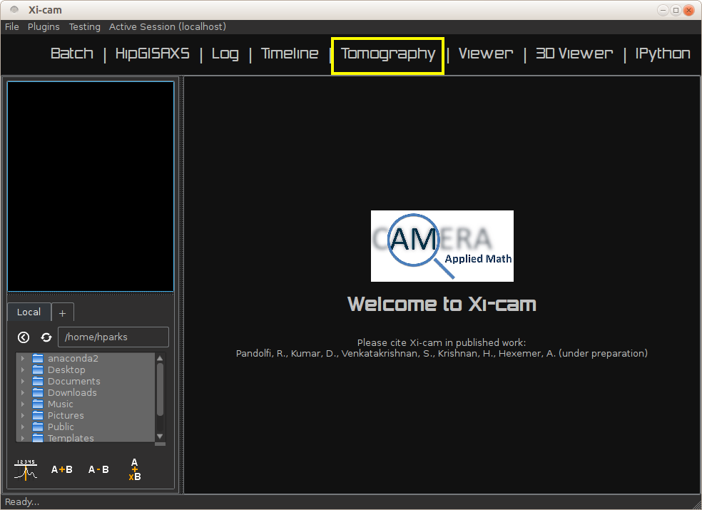
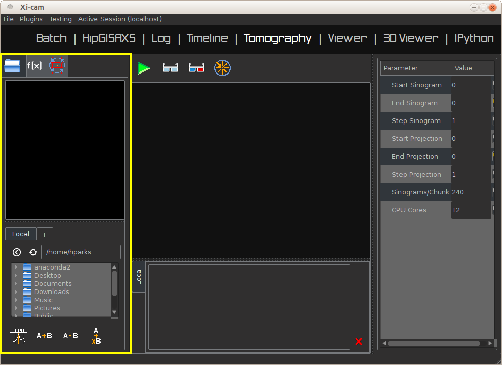
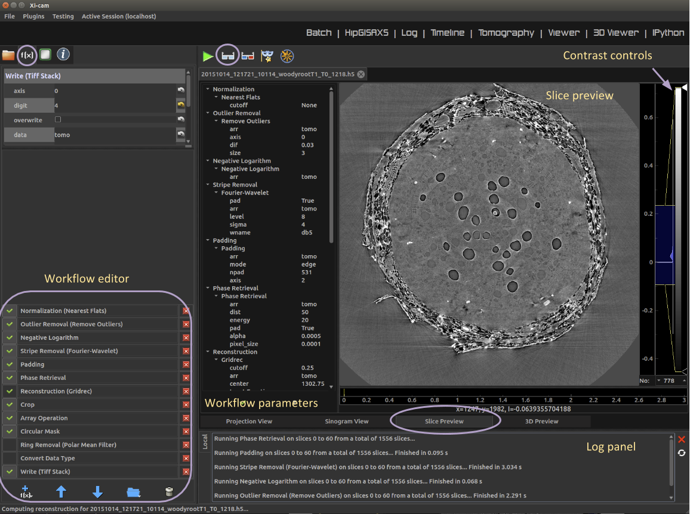
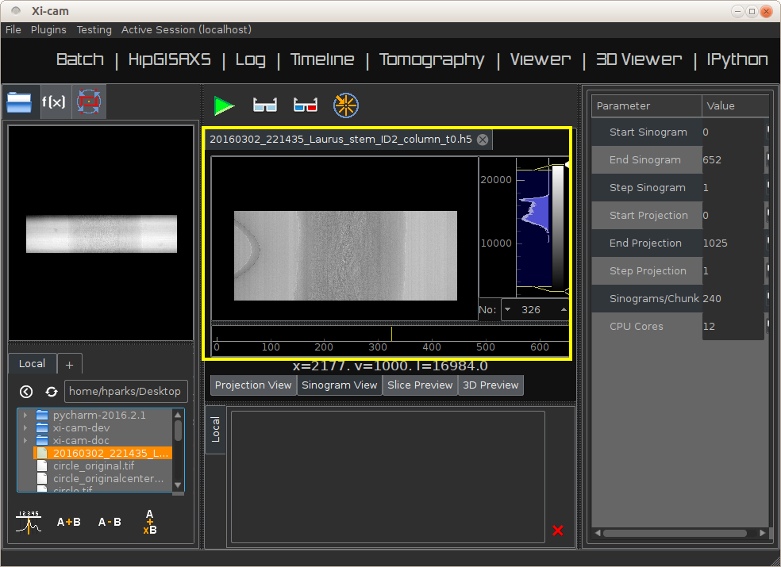
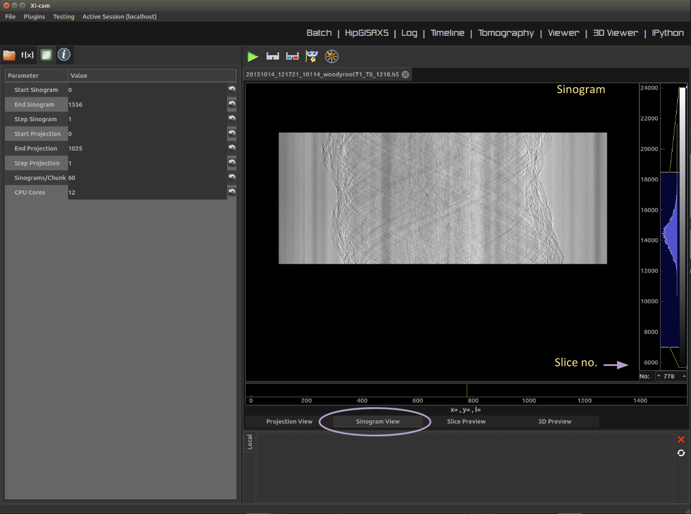

Plugin User Tutorials
=====================

Xi-cam supports a number of different plugins to analyze a variety of synchrotron data. This section provides short
tutorials for using some of these plugins.

Tomography
----------

The tomography plugin is a graphical environment for viewing, analyzing, and reconstructing tomographic data. It uses
the ``TomoPy`` Python library for its processing. With the tomography plugin, you may:

* View the projection data, sinogram data, or metadata of a raw dataset
* Preview a slice of a full reconstruction
* View a 3D image of the reconstructed data
* Run a full reconstruction, with control over the functions and parameters used in the reconstruction

Plugin Layout
^^^^^^^^^^^^^

Upon opening Xi-cam, you will be greeted with a default screen. Click on the tomography plugin in the top toolbar.

These are the main panels and toolbars that are visible in the tomography plugin (see image :ref:`opening_screen`
below):

* Left panel, tab 1: **file browser**. If you click on a file, a thumbnail appears in the upper left panel. If you
  double-click a file, it will be loaded (see :ref:`filebrowser`)
* Left panel, tab 2: **workflow editor**. This shows the sequence of processing steps that will be applied to an input
  data set (see :ref:`workflow_editor`)
* Left panel, tab 3: **computer parameters settings**. Shows the dimensions of the data set and how the data is to be
  divided during a reconstruction.
* Left panel, tab 4: **metadata viewer**. Shows the metadata for the currently loaded data set
* Center upper panel: shows different views and previews of the raw data and tomographic reconstruction
  (see:ref:`main_viewing_panel`)
* Center lower panel: shows a log for various processes
* Center top: **toolbar** with buttons to run and preview reconstructions and to open the manual center of rotation
  detection overlay module (see :ref:`toolbar`)

In most cases, the bar separating any two components can be dragged to resize the window.

.. _opening_screen:

.. _filebrowser:

Opening and Viewing Data
^^^^^^^^^^^^^^^^^^^^^^^^

From the file browser tab, double click an hdf5 file to load it. An hdf5 input file can also be dragged from the system
file browser/explorer/finder window onto the central panel in the tomography plugin and it will be loaded. If you have
a NERSC account and access to data on SPOT Suite, you may log in to preview the data, though you can not load it into
Xi-cam.

All available metadata for the file is displayed in the metadata viewer panel (4th tab on the left panel).

.. _workflow_editor:

Interacting with the Workflow Editor
^^^^^^^^^^^^^^^^^^^^^^^^^^^^^^^^^^^^

The workflow editor shows a series of functions or operations that will be applied to the input data. New functions can
be added by clicking the “+” button at the bottom of the workflow editor tab. Functions can be re-ordered by selecting
a given function and clicking the up or down arrow button at the bottom of the workflow editor tab. Functions can be
removed by clicking the “X” button to the right of each function. For quickly allowing testing of the effect of
different functions, to the left of each function is a box that is either blank or has a check in it--that function is
only carried out if the box is checked. The box can be checked or un-checked by clicking on it.

When you click on a function, the adjustable parameters corresponding to that function appear in the top left panel.
If a user wants to test a range of values for a given parameter, this can be done by right clicking on the name of the
parameter of choice (on the words), and selecting “test parameter range” from the contextual dropdown menu that
appears. This will open a window where the user can select a minimum and maximum value and a step size. At that point,
preview reconstructions will be carried out with each of the values in that range.

By default, a standard pipeline appears in the workflow editor. Some commonly used functions are included in this
default pipeline but are unchecked by default--they are there so that they can be easily added if so desired.

Some functions have required sub-functions, with parameters of their own. The sub-functions of a function appear below
it when you click on that function.

Some functions can operate on multiple possible variables in memory. One of the parameters for these functions is the
array to operate on. For the functions that operate along a particular axis of a 3d matrix, the dimension along
which to operate is also a parameter to select.

A brief description of each function in the default pipeline is given below; more details on many of the functions can
be found in the tomopy or dxchange documentation pages.

* **Normalization** :The tomopy function is used. Briefly, this function subtracts the median dark field from all other
  images, then divides each sample image by the bright field (or “flat field”) image taken closest in time to it.

* **Outlier removal**: Meant to remove “zingers” (when x-rays directly hit the camera). This function performs a median
  filter of a selected sigma on pixels more than a selected threshold away from their neighbors.

* **Negative logarithm**: Converts %Transmission images to absorption scale

* **Fourier-wavelet stripe removal**: Removes vertical stripes from sinograms (removing rings from the reconstruction)

* **Pad**: Adds pixels at the boundaries, this removes artifacts that would otherwise appear near the borders of images
  during reconstructions.

* **Reconstruction**: Performs tomographic reconstruction with selectable fourier filter; default sub-functions are the
  angular range (which is automatically populated based on metadata) and the automatic center-of-rotation detection.

* **Crop**: Reverses the effects of padding, but can also be set to do additional cropping.

* **Array operation**: By default, divides by the pixel size in cm to yield voxel values in units of absorption per cm.

* **Circular mask**: Masks out the corners of the reconstruction, which generally have low-quality data with artifacts.

* **Ring removal**: Ring removal based on stripe removal in a polar transform of the reconstructed data

* **Convert**: Converts from the default 32 bit floating point number format in the reconstruction to 8 bit. The user
  must select appropriate minimum and maximum to appropriately fill the 8bit dynamic range. This can be done by viewing
  the pixel values in the preview reconstruction.

* **Write tiffs**: Writes tif files to disk. User can select parent folder and filename. By default, these are the input
  file’s parent folder and a filename based on the input filename.

.. _main_viewing_panel:

Main Viewing Panel
^^^^^^^^^^^^^^^^^^

Each data set that is opened shows up as a tab within the central main viewer panel. For each open data set, along the
bottom of that central panel there are a series of tabs showing different views of the data. The first tab shows the
raw data. To see different projection angles, users can either move the slider bar along the bottom of the image, or
they can type the number of the projection they want to view in the small number box at the bottom right. Along the
right side of the screen is a colormap editor which allows the user to adjust brightness and contrast and the colormap.
Use the mouse scroll wheel to zoom in and out, and click and drag the image to pan.

At the bottom of the viewer panel is a display of the current x and y position of the cursor with respect to the image
boundary, as well as the value of the pixel under the cursor.

The second tab is the sinogram viewer. This operates in a similar way to the projection viewer.

**Important Note**: when a preview reconstruction is run, it will be run on the slice that is selected at that time in
the sinogram view.

The third tab is the preview reconstruction slice view. Most of this panel operates the same as the others. When
multiple previews are generated, they become a stack in this view which again can be scrolled through with the bar
along the bottom or by typing a number into the box in the bottom right. For each preview slice, the image shows up in
the right half of the panel, and the parameters used in the pipeline to generate that slice show up in the left half of
the panel. At the bottom of this parameter display portion, there is a checkmark button and an x button. The x button
clears that preview from the display. The checkmark button sets the pipeline to use all the parameters as they were
used for that preview. NOTE: when you click the checkmark, if there were functions in the pipeline that were unchecked,
they will be removed from the pipeline completely; they can always be re-added.

Only 10 preview reconstructions are kept in memory, older ones are automatically deleted as more than 10 are added.

.. _toolbar:

Toolbar
^^^^^^^

The first button on the toolbar is a “run reconstruction” button, which will run a reconstruction of the full data set
with the currently selected parameters.

The second button is a “preview slice” button. Clicking this will run the pipeline on a single slice
which is selected in the sinogram view (by default, this is the slice at the halfway point in the stack).

The third button is the “preview 3d” button, which will run a reconstruction of a downsampled version of the whole
data set.

The fourth button is a button to run an “MBIR reconstruction”, which is currently under construction. When complete,
it will submit reconstruction jobs to NERSC, which will use a model-based iterative reconstruction (MBIR)
method to perform the reconstruction.

The fourth button turns on a special overlay mode in the projection view. This can be useful for manually looking for
the center of rotation in a data set. By default, an automatic center-of-rotation detection function is included as a
subfunction to the tomographic reconstruction function in the workflow. In some cases this fails. If this is the case,
the automatic center-of-rotation detection function should be unchecked, and the overlay mode button can be clicked to
find the appropriate value manually. In overlay mode, the selected projection (by default, the first projection) is
overlaid with a horizontally flipped version of the final projection. This is done because we assume data sets are
collected over a range of 180 degrees; finding the necessary translation to get perfect overlap between the image at 0
degrees and the flipped image at 180 degrees will yield the center of rotation. In overlay mode, the overlayed image
can be dragged left or right to find the best overlap, or the left and right arrows can be used to move the overlay one
pixel at a time. Once the optimal overlap is found, click the checkmark box at the top of the panel next to the center
of rotation value--this will populate the center of rotation input parameter to the reconstruction with the value based
on the overlay. **Remember to turn off the automatic center of rotation detection in this case**.

ViewerRMC
---------

The ViewerRMC plugin is a graphical environment for viewing SAXS raw data and using the HipRMC algorithm to construct
images of the original object. It displays the output of the HipRMC algorithm in a timeline viewer, and writes the
parameters and output images into a folder. *Note that using the HipRMC algorithm requires the HipRMC executable to be*
*located in the top Xi-Cam directory*.

