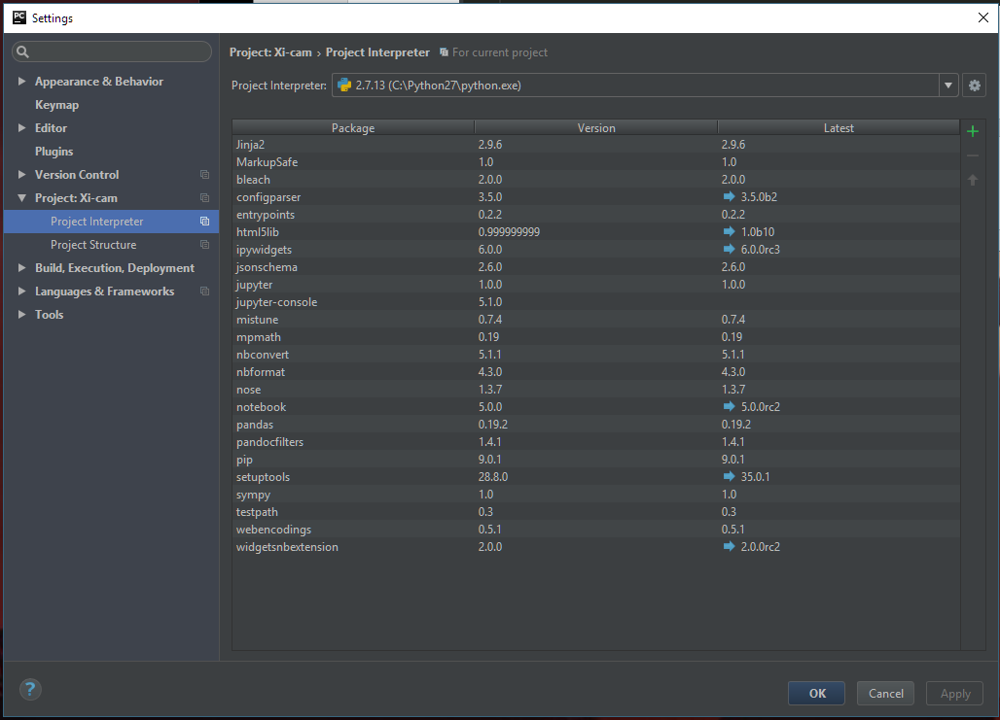
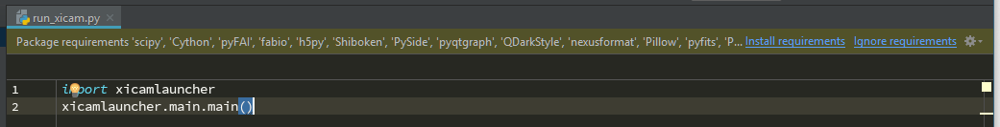

.. highlight:: bat
    :linenothreshold: 2

Running Xi-cam from source in Windows
=====================================

Install Python
--------------

Download and install Python 2.7 for Windows:
https://www.python.org/downloads/release/python-2713/
(Windows x86-64 MSI installer)

Install PyCharm
---------------

Download and install PyCharm:
https://www.jetbrains.com/pycharm/download/download-thanks.html?platform=windows&code=PCC

Clone Xi-cam
------------

1.  Open PyCharm and click on “Check out from Version Control” and then “Git”.

2.  Enter: https://github.com/ronpandolfi/Xi-cam/ and clone.

Configure Python Interpreter
----------------------------

You will now see Xi-cam's files, and need to define which Python version to use:

1.  Click “Ctrl + Alt + s” to open Setting.

2.  Under Project: Xi-cam you will see Project Interpreter. Select C:\\Python27\\python.exe and close the “Settings” by clicking “OK”.

Install Dependencies
--------------------

If you try to run Xi-cam by clicking on the green arrow you will see the missing packages. We will start with clicking on “Install requirements”. This will install some but NOT ALL dependencies.

You will need to download remaining packages from the Unofficial Windows Binaries for Python Extension Packages:

http://www.lfd.uci.edu/~gohlke/pythonlibs/

From here we can download packages that can be easily installed with pip.
The missing packages are (at least for me) are: scipy, pyFAI, tifffile and scikit-image. We also need to change numpy since the numpy installed by PyCharm is missing MKL.
At the beginning of the package find numpy in the list and click on it:

For our 64bit version and python 2.7 we will download:

- numpy-1.12.1+mkl-cp27-cp27m-win_amd64.whl
- scipy-0.19.0-cp27-cp27m-win_amd64.whl
- tifffile-2017.3.17-cp27-cp27m-win_amd64.whl
- scikit_image-0.13.0-cp27-cp27m-win_amd64.whl

To install these, open a command prompt by pressing [Windows] + [R] and enter "cmd".

To test that pip is installed and accessible:

.. code-block:: bat

        > pip -V
        pip 9.0.1 from c:\python27\lib\site-packages (python 2.7)

If you get an error here, add the python27 into your windows environment variables:

.. code-block:: bat

        > set PATH=%PATH%;C:\Python27;C:\Python27\Scripts

now run

.. code-block:: bat

        > pip install --upgrade setuptools pip

To change into the Download folder type

.. code-block:: bat

        > cd Download

(this depends on the location of you Download folder)
Lets first install the correct numpy with MKT
Type:

.. code-block:: bat

        > pip2.7 install numpy-1.12.1+mkl-cp27-cp27m-win_amd64.whl

(the 2.7 is for python 2.7 in case you have a python 3 installation)

Next tifffile, just type:

.. code-block:: bat

        > Pip2.7 install tifffile-2017.3.17-cp27-cp27m-win_amd64.whl

then:

.. code-block:: bat

        > pip2.7 install scikit_image-0.13.0-cp27-cp27m-win_amd64.whl

and finally:

.. code-block:: bat

        > pip2.7 install scipy-0.19.0-cp27-cp27m-win_amd64.whl

now (hopefully) just pyfai left. Just type:

.. code-block:: bat

        > pip2.7 install pyFAI

For PySide currently we need version 1.2.2 therefore use:

.. code-block:: bat

        > pip2.7 install -U PySide==1.2.2

(the ==1.2.2 tells pip to install the 1.2.2 version)

Now go back to PyCharm and run it.

